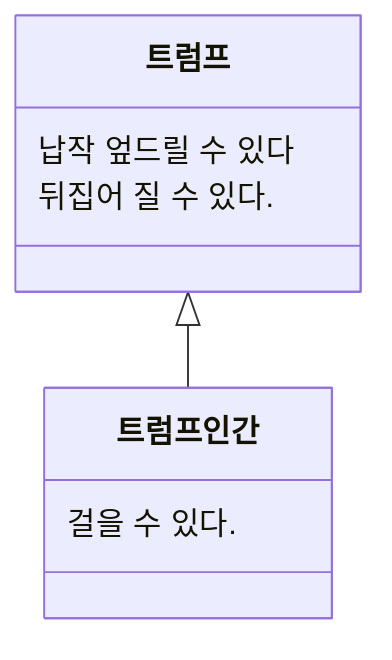

> [!example] 사실적인 정보가 노선도를 이해하기 어렵게 만들었다.
> 1930년대 영국의 초기 노선도는 너무 사실적이여서 노선도를 이해하기 어렵게 만들었다.
> - 승객들의 목적: 하나의 역에서 다른 역으로 이동하는것
> 
> 지도의 `정확도`보다, 어떻게 `목적`에 다다를지 `직관적`으로 표현하는것이 중요하다.
> - [p] 지하철 노선도의 **추상화**

현실에 존재하는 다양한 현상 및 사물과 상호작용하기 위해서는
- 우선 현실을 정확히 이해하고,
- 이해하기 쉽고 예측 가능한 수준으로 분해하고 단순화 해야한다.
> 지하철 노선도 -> 불필요한 지형 정보를 제거함으로써 단순함을 달성한 추성화의 예

> [!tip] 추상화
> 어떤 양상, 세부사항, 구조를 좀 더 명확하게 이해하기 위해 특정 절차나 물체를 의도적으로 생략하거나 감춤으로써 복잡도를 극복하기 위한 방법.
> **복잡성을 다루기 위해 추상화는 두 차원에서 이뤄진다**
> - 첫 번째 차원은 구체적인 사물들 간의 공통점은 취하고 차이점은 버리는 일반화를 통해 단순하게 만드는 것이다.
> - 두번째 차원은 중요한 부분을 강조하기 위해 불필요한 세부사항을 제거함으로써 단순하게 만드는 것이다.
> - [f] 추상화의 목적은 복잡성을 이해하기 쉬운 수준으로 단순화하는 것이다.

>[!caution] 객체 지향 패러다임은 객체라는 추상화를 통해 현실의 복잡성을 극복한다.
>객체 지향 패러다임을 이용해 유용하고 아름다운 애플리케이션을 개발하기 위한 첫걸음은 추상화의 두 차원을 올바르게 이해하고 적용하는 것이다.

# 객체 지향과 추상화

공통점을 기반으로 객체들을 묶기 위한 그릇을 개념(concept)이라고 한다.
개념이란 일반적으로 우리가 인식하고 있는 다양한 사물이나 객체에 적용할 수 있는 아이디어나 관념을 뜻한다.

개념을 이용하면 객체를 여러 그룹으로 분류(classification) 할 수 있다.
- 결과적으로 개념은 공통점을 기반으로 객체를 분류할 수 있는 일종의 체이다.
객체에 어떤 개념을 적용하는 것이 가능해서, 개념 그룹의 일원이 될때 객체를 그 개념의 인스턴스(instance)라고 한다.

> [!tip] 객체란 특정한 개념을 적용할 수 있는 구체적인 사물을 의미한다. 개념이 객체제 적용됐을 때 객체를 개념의 인스턴스라고 한다.

## 개념의 세가지 관점

일반적으로 객체의 분류 장치로서 개념을 이야기할 때는 아래의 세 가지 관점을 함께 언급한다.

- 심볼(Symbol): 개념을 가리키는 간략한 이름이나 명칭
	> 트럼프
- 내연(intension): 개념의 완전한 정의를 나타내며 내연의 의미를 이용해 객체가 **개념**에 속하는지 여부를 확인할 수 있다.
	> 몸이 납작하고 두 손과 두 발은 네모 귀퉁이에 달려있는 등장인물 
- 외연(extension): 개념에 속하는 모든 객체의 집합(set)
	> 정원사, 병사, 신하, 왕자와 공주, 하객으로 참석한 왕과 왕비들...

## 객체를 분류하기 위한 틀

분류는 객체지향의 가장 중요한 개념 중 하나다. 어떤 객체를 어떤 개념으로 분류할지가 객체지향의 품질을 결정한다.
> 분류에 따라 유지보수의 난이도가 좌우된다.

- [*] 더 중요한 것은 적절한 분류 체계는 개발자의 머리속에 정신적인 지도를 제공하게 된다.

> [!tip] 분류란 객체에 특정한 개념을 적용하는 작업이다. 객체에 특정한 개념을 적용하기로 결심했을 때 우리는 그 객체를 특정한 집합의 멤버로 분류하고 있는 것이다.

개념은 객체들의 복잡성을 극복하기 위한 추상화 도구다. 그리고 우리는 매 순간 세상에 존재하는 무수한 사물들을 개념의 틀로 걸러가며 세상을 추상화한다.

# 타입

타입(type)은 개념이다.

## 객체와 데이터 타입

객체지향 프로그램을 작성할 때 우리는 객체를 일종의 데이터(데이터 타입의 데이터)처럼 사용한다.
따라서 객체를 타입에 따라분류하고 그 타입에 이름을 붙이는 것은 결국 프로그램에서 사용할 새로운 데이터 타입을 선언하는 것과 같다.

객체를 창조할 때 가장 중요하게 고려해야 하는 것은 <u>객체가 협력하기 위해 어떤 행동을 해야 할지 결정</u>하는 것이다.
1. 어떤 객체가 ==어떤 타입에 속하는지를 결정하는 것은 객체가 수행하는 행동==이다.
   어떤 객체들이 동일한 행동을 수행할 수 있다면, 그 객체들은 동일한 타입으로 분류될 수 있다.
2. 객체의 내부적인 표현은 외부로 부터 철저하게 감춰진다.
   객체의 행동을 가장 효과적으로 수행할 수만 있다면 객체 내부의 상태를 어떤 방식으로 고려하더라도 무방하다.

## 행동이 우선이다.

객체의 타입을 결정하는 것은 객체의 행동뿐이다. 객체가 어떤 데이터를 보유하고 있는지(내부 표현방식)는 타입을 결정하는데 아무런 영향도 미치지 않는다.

같은 타입에 속한 객체는 행동만 동일하다면 서로 다른 데이터를 가질 수 있다.
- 동일행동 ->동일 책임(= 동일 메시지 수신)
- 동일 메시지를 처리하는 방식은 서로 다를 수 있다. -> ==다형성==

- [*] ==캡슐화==: 데이터의 내부 표현 방식과 무관하게 행동만이 고려 대상이라는 것 => 외부에 데이터를 감춰야한다.
> 데이터가 캡슐화 되지못하고 객체의 인터페이스를 오염시키는 순간 객체의 분류 체계는 급격히 위험에 노출되고, <u>결과적으로 유연하지 못한 설계</u>를 낳는다.

> [!tip] 행동에 따라 객체를 분류하기 위해서는 객체가 내부적으로 관리하는 데이터가 아니라 외부에 제공하는 행동을 먼저 생각해야한다.
> 데이터를 먼저 결정하고 객체의 책임을 결정하는 방법은 유연하지 못한 설계를 초래한다.
> **책임 주도 설계** 라고 부르는 객체지향 설계 방법은 데이터를 먼저 생각하는 **데이터-주도 설계** 방법의 단점을 개선하기 위해 고안됐다.

# 타입의 계층

## 일반화/ 특수화의 관계

타입과 타입사이에는 일반화/ 특수화 관계가 존재할 수 있다.
> 트럼프는 트럼프 인간보다 더 일반적인 개념이다. 더 일반적이라는 말은 더 포괄적이라는 의미를 내포하기 때문에 트럼프는 트럼프 인간에 속하는 객체를 포함한다.

>[!tip] 일반화/특수화 관계를 결정하는 것은 객체의 상태를 표현하는 데이터가 아니라 행동이다.
>일반적 타입이란 특수한 타입이 가진 모든 행동들 중에서 일부 행동만을 가지는 타입을 가리킨다.
>단, 특수한 타입은 일반적인 타입이 할 수 있는 모든 행동을 동일하게 수행할 수 있어야 한다.

- 더 일반적인 타입을 슈퍼타입(supertype)
- 더 특수한 타입을 서브타입(subtype) 이라고 한다.

> 일반화/ 특수화 관계 표기법

