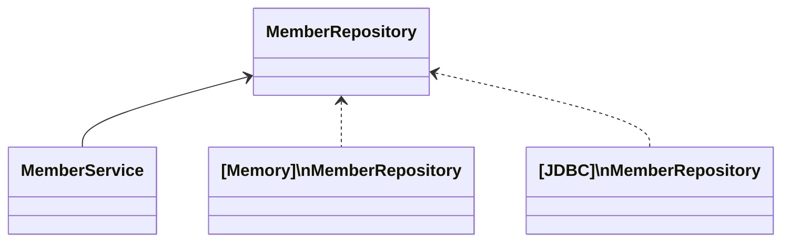

- [스프링 프로젝트 시작하기(start.spring.io)](https://start.spring.io/)
	- 스프링 버전을 을 넣으면 초기 프로젝트를 설정해준다!
- [스프링 문서](https://spring.io/)
	- 버전에 맞는 스프링 피쳐를 찾아볼 수 있다

---
## 정적 컨텐츠의 동작


> 스프링 컨테이너에 `hello-static`에 관련된 컨트롤러가 없다
> 그렇다면 화면을 찾아서 반환해준다.

```kotlin
@Controller
class HelloController{

	@GetMapping("hello")
	fun hello(@RequestParam("name") name: String, model: Model): String {
		// model: 서버 템플릿 엔진에서 사용할 수 있는 객체를 저장할 수 있음
		model.addAttribute("name", name)
		// 컨트롤러에서 리턴 값으로 문자를 반환하면 뷰 리졸버(viewResolver)가 화면을 찾아서 처리
		// resources/template/ + {viewName} + .html
		return "hello-template!"
	}
}
```

- queryParam의 기본 설정값은 `true` 여서 만약 queryParam이 없다면 에러
- 여기에서, hello-template를 반환하므로, veiwResolver가 `hello-template.html`를 찾아서 렌더링 해줄것이다.


- 만일 Json으로 반환해주고 싶다면 `@ResponseBody`를 사용하면 된다.

```kotlin
@GetMapping("hello-string")  
@ResponseBody
fun helloString(@RequestParam("name") name: String): String {  
return "hello $name"  
}
```


- `@ResponseBody`어노테이션을 사용하면 `viewResolver`대신 `HttpMessageConverter`가 동작한다.
	- 기본 문자처리: `StringHttpMessageConverter`
	- 기본 객체처리: `MappingJackson2HttpMessageConverter`
		- 구글에서 만든 gson도 많이 사용하긴 하는데, Jackson라이브러리가 스프링 기본이다.

> [!info] 클라이언트 HTTP Accept헤더와, 서버 컨트롤러 반환 타입 조합
`HttpMessageConverter`가 선택된다.


# 스프링 빈과 의존관계

- `@Autowired` 가 있으면 스프링이 연관된 객체를 스프링 컨테이너에서 찾아서 넣어준다.
  이렇게 객체 의존관계를 외부에서 넣어주는 것을 DI (Dependency Injection) 의존성 주입이다.

## 의존성 주입(DI; Dependency Injection)의 종류와 주의점

- [c] ~~필드 주입 (사용 x)~~
```kotlin
class MemberController {
@Autowired private lateinit var memberService: MemberService
}
```
필드 주입은 주로 간단한 의존성 주입에 적합하다.
해당 클래스에 대한 의존성이 바뀔수 없는경우 사용되어야 한다.

- [c] Setter 주입
```kotlin
@Autowired fun setMemberService(memberService: MemberService){
	this.memberService = memberService
}
```
동적으로 의존성이 변경되는 경우 사용될 수 있다 (하지만 그런 경우는 거의 없다.)

- [p] 생성자 주입
```kotlin
@Controller  
class MemberController @Autowired constructor(  
private val memberService: MemberService  
) {}
```
일반적으로 생성자 주입이 권장된다.
생성자 주입은 명시적으로 의존성을 주입하므로, 코드의 명확성이 높고 테스트 용이성이 높다.

- [i] 참고: kotlin에서의 primary constructor은 어노테이션을 사용할 때 `constructor`를 반드시 표기하여야 한다.
- [i] 생성자에서 `@Autowired`를 사용하면 객체 생성 시점에 스프링 컨테이너에서 해당 스프링 빈을 찾아서 주입한다. 생성자가 1개만 있으면 `@Autowired`는 생략할 수 있다.
	- 스프링5부터 가능!

- [?] 생성자 주입 시 주입 순서가 중요할까?
	- 순서가 의존성 간 의존관계를 나타내고, 순서를 지켜야 하는 경우 의존성이 있을 수 있다.
	- 순환 참조가 발생하는 경우 순서가 매우 중요하다.

## 컴포넌트 스캔 (Component Scan)

Spring 프레임워크에서 자동으로 빈을 검색하고 등록하는 메커니즘. 개발자가 일일이 모든 빈을 등록하지 않고도 Spring이 클래스 경로에서 자동으로 빈을 찾아 등록할 수 있게 해준다.

`@Component`어노테이션이 부여된 클래스 및 그와 연관된 어노테이션들을 탐지하여 빈으로 등록한다.
- `@Component`어노테이션은 일반적으로 Spring 빈으로 등록하려는 클래스에 사용되며, 이 외에도 다양한 스캔 대상을 위한 어노테이션들이 있다.
	- `@Repository`
	- `@Service`
	- `@Controller`
	등등 위 어노테이션들은 내부에 `@Conponent`가 존재한다.

컴포넌트 스캔을 사용하면 애플리케이션을 모듈화하고 유지보수하기 쉽게 해준다. 또한 AOP같은 기능에도 기여하는것.

# 직접 스프링 빈 등록하기

드물긴 하지만, 정형화 되지 않거나, 상황에 따라 구현 클래스를 변경해야 하면, 설정을 통해 스프링 빈으로 등록한다.

```kotlin
@Configuration
class SpringConfig {
	@Bean
	fun memberService(): MemberService {
		return MemberService(memberRepository())
	}

	@Bean
	fun memberRepository(): MemberRepository {
		return MemoryMemberRepository()
	}
}
```

# h2 데이터 베이스 추가하기

- build.gradel.kts
```kts
dependencies{
	implementation("org.springframework.boot:spring-boot-starter-data-jdbc") // JDBC  
	runtimeOnly("com.h2database:h2") // H2 Database
}
```

- application.properties
```application.properties
spring.datasource.url=jdbc:h2:tcp://localhost/~/test  
spring.datasource.driverClassName=org.h2.Driver

# spring 4버전 이부터 username이 추가되어야함
spring.datasource.username=sa
```


## 구현 클래스 추가 이미지



- 개방- 페쇄원칙(OCP; Open-Closed Principle)
	- 확장에는 열려있고, 수정, 변경에는 닫혀있다
- ==스프링의 DI(Dependencies Injection)을 사용하면 **기존 코드를 전혀 손대지 않고** 설정만으로 구현 클래스를 변경할 수 있다.==


# 데이터 베이스 테스트코드

```kotlin
@SpringBootTest
@Transactional
class NMemberServiceIntegrationTest{
	@Autowired  
	lateinit var memberService: MemberService  
	@Autowired  
	lateinit var memberRepository: MemberRepository
}
```
- `@SpringBootTest`: 스프링 컨테이너와 테스트를 함께 실행한다.
- `@Transactional`: 테스트 케이스에 이 애노테이션이 있으면, 테스트 시작 전에 트랜잭션을 시작하고, 테스트 완료 후에 항상 롤백한다. 
	- `@Commit`롤백 없이 커밋하는 옵션도 존재함

# Spring JDBC Template

> [!tip] 순수 Jdbc와 동일한 환경설정을 하면 된다.
> 스프링 Jdbc template과 MyBatis같은 라이브러리는 JDBC API에서 본 반복 코드를 대부분 제거해준다. 하지만 SQL은 직접 작성해야 한다.


## 스프링 config 변경

- DataSource는 데이터베이스 커넥션을 획득할 때 사용하는 객체.
  스프링 부트는 데이터베이스 커넥션 정보를 바탕으로 DataSource를 생성하고 스프링 빈으로 만들어둔다. 그래서 DI를 받을 수 있다. 

```kotlin
import javax.sql.DataSource

@Configuration  
class SpringConfig(  
  private val dataSource: DataSource  
) {  
  
@Bean  
fun memberService(): MemberService {  
return MemberService(memberRepository())  
}  
  
@Bean  
fun memberRepository(): MemberRepository {  
   return JdbcTemplateMemberRepository(dataSource) // JdbcTemplate 사용  
  }  
}
```


# JPA

- JPA는 기존 반복 코드는 물론이고, 기본적인 SQL도 JPA가 직접 만들어서 실행해준다.
- JPA를 사용하면, SQL과 데이터 중심 설계에서 객체 중심의 설계로 패러다임을 전환할 수 있다.

**build.grdle파일에 JPA, h2관련 라이브러리 추가**

```build.gradle
implementation 'org.springframework.boot:spring-boot-starter-data-jpa' runtimeOnly 'com.h2database:h2'
```
> spring-boot-starter-data-jpa 는 내부에 jdbc 관련 라이브러리를 포함한다. 따라서 jdbc는 제거해도 된다.

**spring boot에 JPA설정 추가**

```application.properties
spring.jpa.show-sql=true
spring.jpa.hibernate.ddl-auto=none
```
> - show-sql: JPA가 생성하는 SQL을 출력
> - ddl-auto: JPA는 데이터를 자동으로 생성하는 기능을 제공하는데, `none`을 사용하면 해당 기능을 끈다.
> 	- create를 사용하면 엔티티 정보를 바탕으로 테이블도 직접 생성해준다.

## JPA Entity 매핑

```kotlin
import jakarta.persistence.*  
  
@Entity  
class Member(name:String? = null) {  
  
@Id  
@GeneratedValue(strategy = GenerationType.IDENTITY)  
// DB가 알아서 생성해주는 것을 IDENTITY라고 함  
var id: Long? = null  
  
@Column()  
var name : String? = name  
  
  
}
```

## JPA 회원 리포지토리

```kotlin
package hello.hellospring.repository

import hello.hellospring.domain.Member  
import jakarta.persistence.EntityManager  
import org.springframework.transaction.annotation.Transactional  
  
@Transactional  
class JpaMemberRepository(private val entityManager: EntityManager) : MemberRepository {

override fun save(member: Member): Member {  
	entityManager.persist(member)  
	return member  
}  
  
override fun findById(id: Long?): Member? {  
	return entityManager.find(Member::class.java, id)  
}  
  
override fun findByName(name: String?): Member? {  
	return entityManager  
		.createQuery("select m from Member m where m.name = :name", Member::class.java)  
		.setParameter("name", name)  
		.resultList  
		.firstOrNull()  
}  
  
override fun findAll(): List<Member> {  
	// JPQL -> 객체 지향 쿼리 언어  
	// 객체를 대상으로 쿼리를 날림  
	return entityManager  
	.createQuery("select m from Member m", Member::class.java) // select 대상이 'm'.resultList  
}  
  
}
```

## 스프링 데이터 JPA

스프링 부트와 JPA만 사용해도 개발 생산성이 많이 증가한다.

```kotlin
package hello.hellospring.repository  
  
import hello.hellospring.domain.Member  
import org.springframework.data.jpa.repository.JpaRepository  
  
// JpaRepository <T, ID> : T는 엔티티, ID는 엔티티의 PK 타입  
// JpaRepository를 상속받으면 SpringDataJpa가 구현체를 만들어서 Spring Bean에 등록해줌  
// 인터페이스만 만들어두면 구현체를 자동으로 만들어줌  
interface SpringDataJpaMemberRepository : JpaRepository<Member, Long>, MemberRepository {  
// select m from Member m where m.name = ?  
override fun findByName(name: String?): Member?  
}
```

**스프링 데이터 JPA 제공 기능**
- 인터페이스를 통한 기본적인 CRUD
- `findByName()`, `findByEmail()`처럼 메서드 이름 만으로 조회 기능 제공
- 페이징 기능 자동 제공

> JAP + 스프링 데이터 JPA를 기본으로 사용한다.
> 복잡한 동적 쿼리는 `Querydsl`이라는 라이브러리를 사용하면 된다.
> - `Querydsl`을 사용하면 쿼리도 자바 코드로 안전하게 작성할 수 있고, 동적 쿼리도 편안하게 작성할 수 있다.


# AOP

## AOP가 필요한 상황

- 모든 메소드의 호출 시간을 측정하고 싶다면?
- 공통 관심 사항(cross-cutting concern) vs 핵심 관심 사항(core concern)


# AOP 적용

**공통 관심사항과 핵심 관심사항의 분리!**


## 스프링의 AOP 동작 방식

- AOP적용 전 의존관계
	컨트롤러가 서비스를 의존하면서 필요한 메서드를 호출

- AOP 적용 후 의존관계
	- 프록시를 만들어 스프링이 실행될 때 컨테이너에 진짜 스프링 빈 말고 가짜 스프링 빈을 앞에 세운다.


## AOP 적용 후 전체 그림

적용 후에는 프록시 호출하는 흐름으로 동작한다.
스프링 컨테이너에서 빈을 관리하면 가짜를 만들어 주입하는게 쉬워지기때문에, DI의 장점이다.


```kotlin
@Controller  
class MemberController @Autowired constructor(  
private val memberService: MemberService  
) {  
	init {  
	println("memberService = ${memberService.javaClass}")  
	}
}
```

실제 controller동작시 어떤것이 들어오는지 확인하면 
```
memberService = class hello.hellospring.service.MemberService$$SpringCGLIB$$0
```

- `CGLIB (Code Generation Library)`가 출력됨
	`$$SpringCGLIB$$`로 시작하는 클래스들은 모두 CGLB에 의해 생성된 동적 프록시이다.


---

실습한 코드(코틀린으로 작성): https://github.com/melangyun/spring-Introduction
aop 참고: https://dodeon.gitbook.io/study/kimyounghan-spring-introduction/07-aop