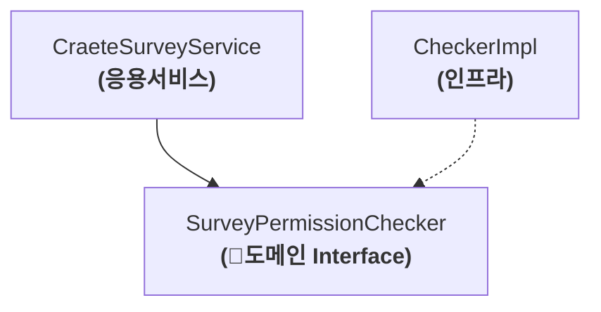

도메인 영역의 코드를 작성하다보면, 한 애그리거트로 기능을 구현할 수 없을 때가 있다.
이럴때 한 애그리거트에 넣기 애매한 도메인 기능을 억지로 특정 애그리거트에 구현하면 안된다. (자신의 책임을 넘어서는 기능 구현)

>[!tip] 이때에 도메인 기능을 별도의 서비스로 구현한다. = 도메인 서비스


# 7.2 도메인 서비스

도메인 서비스는 도메인 영역에 위치한 도메인 로직을 표현할 때 사용한다.
주로 다음 상황에서 도메인 서비스를 사용한다.

- 계산로직
  **여러 애그리거트가 필요한 계산 로직**이나, 
  **한 애그리거트에 넣기에는 다소 복잡한 계산 로직**
- 외부 시스템 연동이 필요한 도메인 로직
  구현하기 위해 타 시스템을 이용해야 하는 도메인 로직


## 7.2.1 계산 로직과 고메인 서비스

도메인 서비스는 도메인 구성요소와 달리, 상태 없이 로직만 존재한다.
도메인 서비스의 사용 주체는 **에그리거트가 될수도**, **응용 서비스**가 될 수도 있다.
```java
// ☕ 애그리거트 주체 예시
public class Order {
	public void calculateAmounts(
	DiscountCalculationService discalService, 
	MemberGrade grade
	){
		Money totalAmounts = getTotalAmounts();
		Money discountAmounts = discalService.calculateDiscountAmounts(this.orderLines, this.coupons, grade);
		.. ..
	}
}
```
> [!warning] 도메인 서비스 객체를 애그리거트에 주입하지 않기


## 7.2.2 외부 시스템 연동과 도메인 서비스



도메인 서비스의 구현이 특정 구현 기술에 의존하거나, 외부 시스템의 API를 실행한다면 도메인 영역의 도메인 서비스는 인터페이스로 추상화해야 한다. 이를 통해 도메인 영역이 특정 구현에 종속되는 것을 방지할 수 있고 도메인 영역에 대한 테스트가 쉬워진다.

